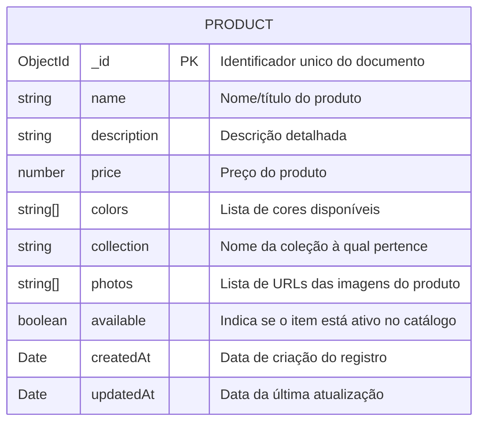
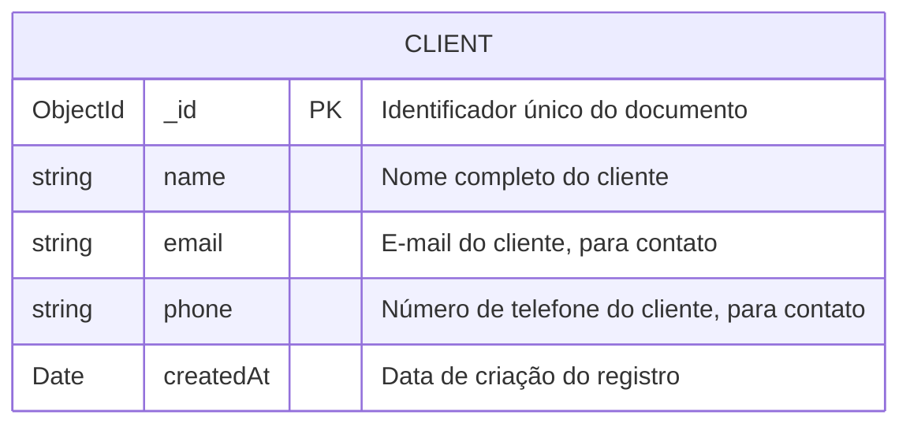
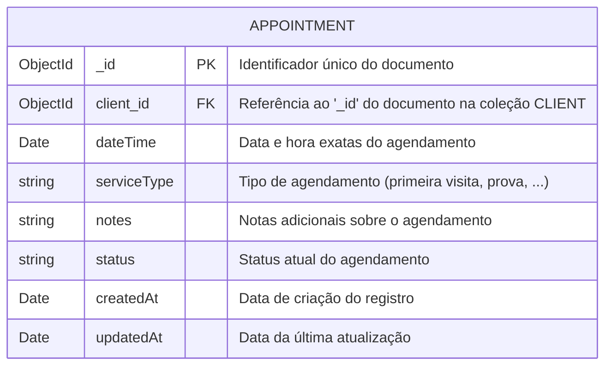
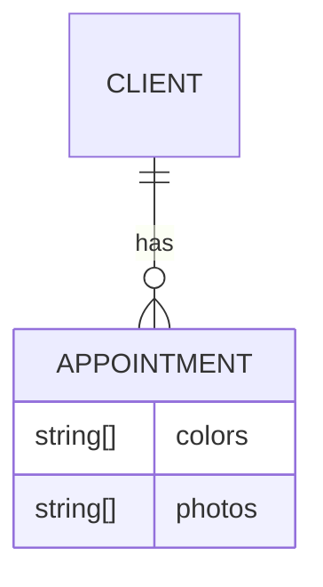

# Modelagem Inicial do Banco de Dados (MongoDB)

Este documento descreve a estrutura inicial das coleções e documentos no banco de dados MongoDB para o projeto Raffinata Sposa.

## Coleções Principais:

### `product`

Representa os produtos (vestidos de noiva, etc.) disponíveis no catálogo.

### `clients`

Armazena informações básicas dos clientes que realizam agendamentos.

### `appointments`

Registra cada agendamento realizado pelos clientes.

## Relacionamentos

Aqui detalhamos os relacionamentos entre as principais coleções.

## Próximos Passos:

- Refinar este modelo conforme novas necessidades surgirem.

- Implementar os modelos no código backend usando Mongoose.

- Instalar e configurar o MongoDB.

- Criar scripts iniciais para conectar ao MongoDB e criar coleções/índices se necessário.